  <!-- Dynamic Hero Banner switching based on GitHub Theme -->
  <picture>
    <source media="(prefers-color-scheme: dark)" srcset="dark.svg">
    <source media="(prefers-color-scheme: light)" srcset="light.svg">
    
  </picture>

   
  
  
 
     
  

---

### 💫 About Me

🌱 I’m a Software Engineering undergraduate with a passion for building impactful solutions. 
🤝 I’m always open to collaborating on innovative projects and expanding my technical skill set. 
📫 Let's connect: [dsharon.dev@gmail.com](mailto:dsharon.dev@gmail.com) 
🎧 Fun fact: When I’m not writing code, I’m usually discovering new music or curating the perfect playlist.

  
  
  

---

### 💻 Tech Stack & Tools

  <h4>Languages & Frameworks</h4>
  
  
  
  
  
  
  
  
   
  
  
  
  
  
  <h4>Development Tools & AI</h4>
  
  
  
  
  
  
   
  
  

---

  <h3>✍️ Random Dev Quote</h3>
  

---

  <h3>🐍 Watch the snake eat up my contributions! 🐍</h3>
  

---

